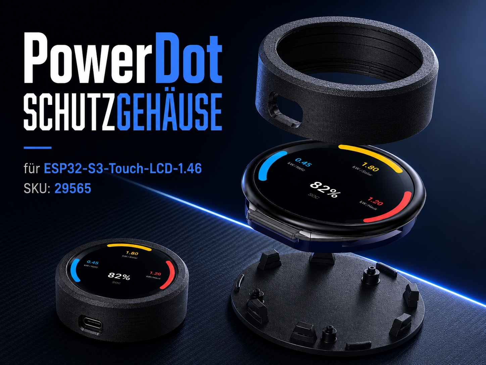
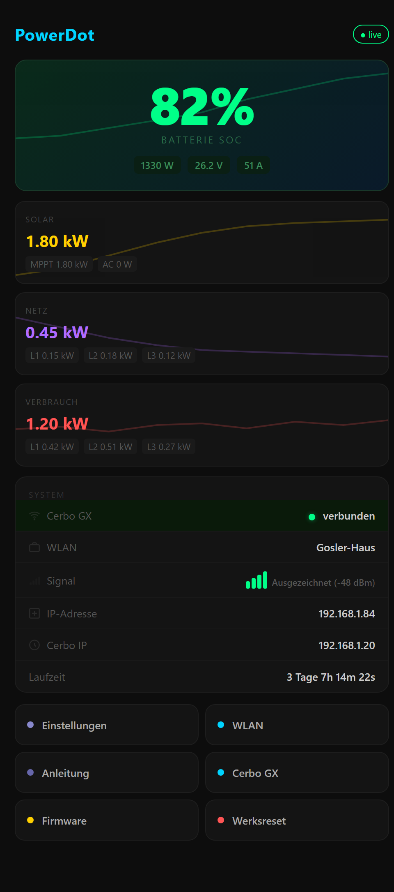
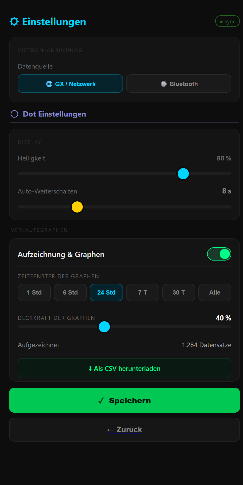
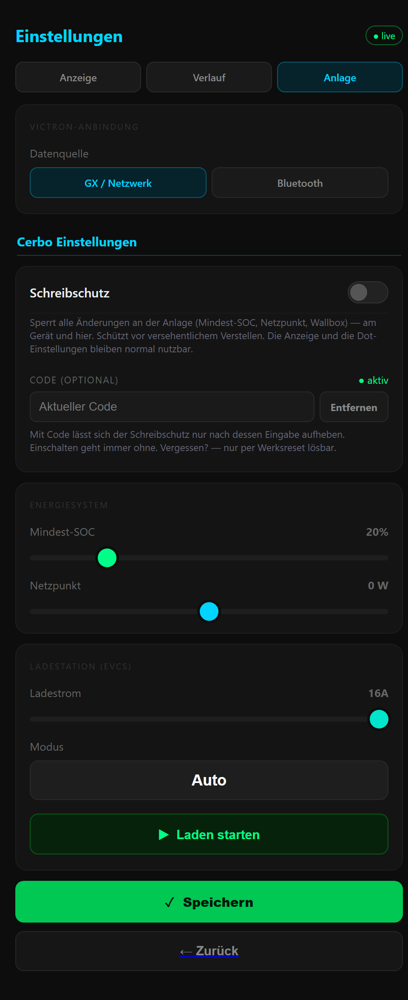
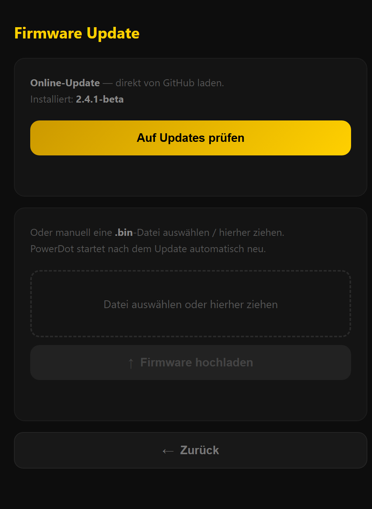
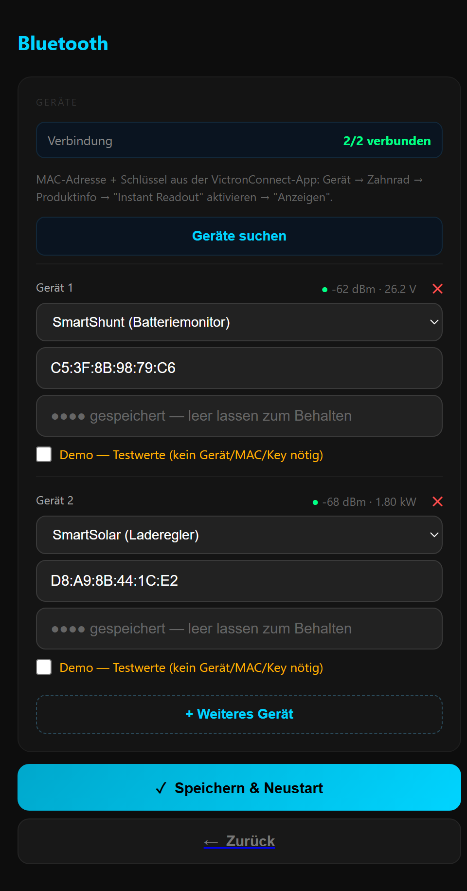
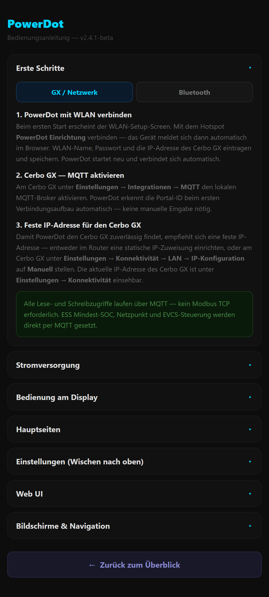
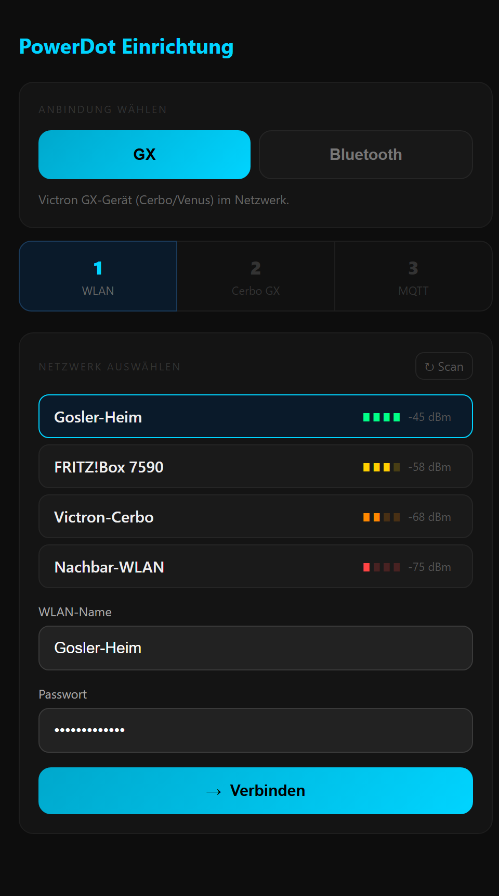
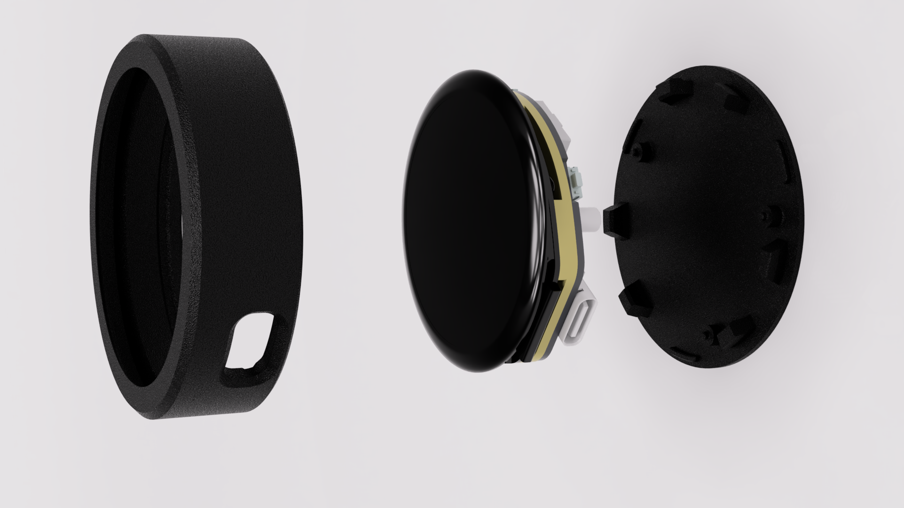
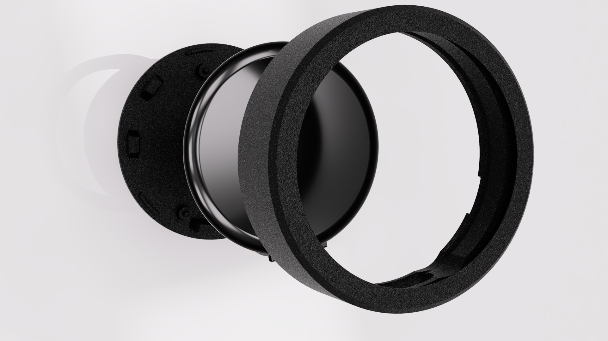

# PowerDot

**PowerDot** ist ein kompakter Energiemonitor mit rundem Touch-Display, der die
wichtigsten Werte deiner Victron-Anlage auf einen Blick zeigt — Ladezustand (SOC),
Solar, Netz und Verbrauch. Basis ist ein **ESP32-S3-Touch-LCD-1.46**.

Die Daten kommen wahlweise
- ueber das Netzwerk von einem **Victron GX / Cerbo (MQTT)** oder
- **direkt per Bluetooth** aus den Victron-Geraeten (SmartShunt, SmartSolar MPPT,
  Smart Lithium u.a.) — komplett **ohne Cerbo/GX**.

Eingerichtet wird alles bequem ueber eine **Web-Oberflaeche** (eigener Hotspot beim
ersten Start); Firmware-Updates laufen **ueber die Luft (OTA)** direkt aus diesem Repo.

Dieses Repo enthaelt die **oeffentlichen Firmware-Releases** (.bin-OTA-Assets) und das
Web-Flash-Tool. Der Firmware-Quellcode bleibt privat.

---

## Auf einen Blick

- Rundes 1,46-Zoll-Touch-Display, mehrere Uebersichts- und Detailseiten (Wischgesten)
- Peak-Hold-Arcs fuer Netz / Solar / Verbrauch
- **Verlaufsgraphen:** interne Langzeit-Aufzeichnung + dezente Trend-Kurven im Hintergrund
- Zwei Datenquellen: Victron GX/MQTT **oder** Victron-Bluetooth-Direktmodus
- Web-UI fuer Einrichtung, Einstellungen, Verlauf (CSV-Export) und Firmware-Update
- Optionales, 3D-druckbares **Schutzgehaeuse** (SKU 29565)

---

## Web-Oberflaeche

| Dashboard | Einstellungen | Schreibschutz & PIN |
|---|---|---|
|  |  |  |
| **Firmware-Update** | **Bluetooth-Direktmodus** | **Anleitung** |
|  |  |  |
| **Ersteinrichtung** | | |
|  | | |

---

## Schutzgehaeuse

Passgenaues, 3D-druckbares Gehaeuse fuer das ESP32-S3-Touch-LCD-1.46 (SKU 29565).

| Explosionsdarstellung | Detail |
|---|---|
|  |  |

---

## Firmware installieren

- **OTA (empfohlen):** Web-UI → *Firmware-Update* → *Auf Updates pruefen*.
- **Web-Flash-Tool:** [scoolt96.github.io/PowerDot-fw](https://scoolt96.github.io/PowerDot-fw)
  — Geraet per USB anschliessen und direkt im Browser flashen.

> Nach einem Flash ueber das Web-Tool bleibt das Display bewusst dunkel. Bitte das
> Geraet einmal vom Strom trennen und neu starten (sauberer Kaltstart).

---

## Changelog

### v2.6.0-beta - 2026-07-20

**Zeitgesteuerte Modi, Nachtmodus und eine feste Startseite** — plus ein aufgeraeumtes Auswahlmenue in der Web-UI.

**Neu**
- **Zeitgesteuerte Modi + Nachtmodus:** bis zu 5 eigene Modi nach Uhrzeit & Wochentag (je Modus Helligkeit, Timeout, Autoscroll, feste Startseite, Toene stumm). Der Nachtmodus schaltet das Display in den Ruhezeiten ~30 s nach der letzten Beruehrung ab
- **Startseiten-Ruecksprung pro Modus:** hat ein Modus eine feste Startseite, kehrt das Display nach 60 s ohne Eingabe automatisch dorthin zurueck
- **Boot-Startseite:** in "Aktive Seiten" per Haus-Button festlegen, welche Seite beim Geraetestart zuerst erscheint (Einfachauswahl)
- **Automatische Display-Drehung** ueber den Lagesensor
- **Echte Uhrzeit** (RTC + Zeitserver) als Grundlage der zeitgesteuerten Funktionen
- **Schoeneres Auswahlmenue in der Web-UI** (eigenes Dropdown statt des Browser-Standards)

**Verbessert**
- **Neu gestaltete Einstellungsseiten am Geraet** — einheitliche Schieberegler-Optik
- **Solar-Detailanzeige** listet MPPT- und AC-Quellen jetzt alphabetisch
- Behoben: die Seiten-Indikatoren am unteren Rand blendeten bei Web-Aenderungen faelschlich auf den Einstellungsseiten ein

**Unter der Haube**
- Firmware weiter auf die gemeinsame **PowerDotCore**-Bibliothek umgestellt (geteilte Basis mit PowerDot Air) — Uhrzeit, Display-Drehung, Modi und das neue Web-Dropdown kommen jetzt aus dem Core

---

### v2.4.1-beta - 2026-07-18

**Bedienung & Web-UI ueberarbeitet:** frei sortierbare Seiten, Schreibschutz und ein aufgeraeumtes, animiertes Interface.

**Neu**
- **Hauptseiten frei sortierbar:** Reihenfolge der Seiten per Drag & Drop in der Web-UI aendern — sie spiegelt sich sofort auf dem Geraet
- **Schreibschutz-Modus mit optionalem PIN:** sperrt alle Schreibzugriffe auf die Victron-Anlage (ESS-SOC, Netzpunkt, Wallbox), damit nichts versehentlich verstellt wird
- **Einstellungen in Reitern:** Anzeige / Verlauf / Anlage statt einer langen Scroll-Seite
- **Werte beim Hovern:** ueber den Verlaufs-Kurven (Startseite und Kacheln) den Wert zum Zeitpunkt einblenden
- **Kurvenauswahl** fuer die Verlauf-Seite: einzelne Kurven (Solar/Netz/Last/SOC) an- und abwaehlen
- **Dezente Einblend-Animationen** auf allen Web-Seiten

**Verbessert**
- **Verlauf-Seite am Geraet:** deutlich groessere, farbcodierte Werte (die Farbe zeigt die Zuordnung, keine Beschriftung noetig)
- **Solar-Seite** blendet nicht vorhandene MPPT-/AC-Quellen aus, statt "--" anzuzeigen
- **Wallbox** bekommt einen eigenen Verlaufsgraphen; GX-/Bluetooth-spezifische Seiten werden je nach Modus ein-/ausgeblendet
- Aufgeraeumte, **emoji-freie** Oberflaeche; klarer abgesetzte Aufklapp-Bereiche

---

### v2.3.0-beta - 2026-07-15

**Grosses Update:** Bluetooth-Direktmodus, Langzeit-Logger und Verlaufsgraphen.
(Enthaelt auch die intern gebauten Zwischenstaende 2.1/2.2 — oeffentlich zuletzt v2.0.5-beta.)

**Neu**
- **Victron Bluetooth-Direktmodus:** PowerDot liest Victron-Geraete direkt per Bluetooth aus (SmartShunt, SmartSolar MPPT, Smart Lithium u.a.) — ganz **ohne Cerbo/GX**. Datenquelle (GX/Netzwerk oder Bluetooth) im Setup waehlbar, WLAN optional (echter Standalone-Betrieb)
- **Geraete-Scan und -Einrichtung** in der Web-UI: nahe Victron-Geraete finden und per Instant-Readout-Key einbinden (bis zu 4). Weitere Typen (Wechselrichter, Orion DC-DC, AC-Lader, Battery Protect) als Detailkarten
- **Demo-Modus** je Geraet: synthetische Werte zum Ausprobieren der Oberflaeche ohne Hardware
- **Smart-Lithium-Seite** am Geraet: Zellspannungen, Balancer und Temperatur (erscheint nur, wenn ein Smart Lithium wirklich Daten liefert)
- **Langzeit-Logger:** zeichnet SOC / Solar / Netz / Last / Batterie dauerhaft intern auf (Bluetooth-Modus bis 90 Tage, GX-Modus 24 h — der Rest liegt ohnehin im VRM). Ein-/ausschaltbar, CSV-Export ueber die Web-UI
- **Verlaufsgraphen:** dezente Trend-Kurven im Hintergrund der Werte, eigene "Verlauf"-Seite mit Solar/Netz/Last/SOC auf einer Achse (Deckkraft einstellbar). Das Web-Dashboard zeigt den Verlauf jetzt blass hinter den einzelnen Kacheln

**Verbessert**
- Splash-Animation ruhiger (langsamer laufende Ringe)
- Im Bluetooth-Modus werden nicht verfuegbare Seiten (Netz/Lasten/Wallbox) automatisch ausgeblendet

**Hinweis**
- Der Bluetooth-Direktmodus und einige der neuen Geraetetypen sind noch Beta (an echter Hardware bisher nur teilweise geprueft)

---

### v2.0.5-beta - 2026-07-10

**Neu**
- Setup-Assistent (Schritt 3): MQTT-Verbindungstest - "Speichern & Neustart" wird erst freigegeben, wenn die Verbindung zum Cerbo/Broker erfolgreich getestet wurde (verhindert das Speichern einer falschen IP oder bei nicht aktiviertem MQTT-Zugang)

**Verbessert**
- OTA-Updatepruefung zuverlaessiger: laeuft jetzt ueber github.com (releases.atom) statt api.github.com, das auf dem Geraet im TLS-Handshake haengen konnte

---

### v2.0.4-beta - 2026-06-27

**Neu**
- "MQTT nicht verbunden"-Screen: das Display zeigt klar an, wenn der Cerbo konfiguriert, MQTT aber getrennt ist (inkl. Kurzanleitung) - verschwindet automatisch bei Verbindung
- Setup-Assistent: neuer 3. Schritt "MQTT aktivieren" (Einstellungen -> Integrationen -> MQTT-Zugang)
- Hotspot-Name kontextabhaengig: "PowerDot Einrichtung" bei der Ersteinrichtung, "PowerDot Web UI" beim manuell gestarteten Hotspot

**Behoben**
- Kein periodisches Einfrieren mehr bei nicht erreichbarem Cerbo/MQTT (nicht-blockierender TCP-Probe statt blockierendem Connect)
- Splash-Haenger behoben: MQTT-Connect laeuft jetzt unsichtbar in der Splash-Animation
- Setup-Assistent: "Verbinden"-Button und WLAN-Auswahl funktionierten nicht (defektes JavaScript) - behoben

---

### v2.0.3-beta - 2026-06-23

**Behoben**
- Autoscroll/Timeout/Helligkeit-Wert wird nach Neustart korrekt wiederhergestellt (NVS-Debounce entfernt)
- OTA-Updatepruefung funktioniert jetzt auch mit Beta-Releases (HTTP 404 behoben)
- Werksreset-Arc bricht nicht mehr vorzeitig ab beim 5s-Halten (PRESS_LOST-Fehlausloeser entfernt)
- WiFi-Setup: Eingabefelder heller und besser sichtbar

---

### v2.0.2-beta - 2026-06-18

**Behoben**
- Autoscroll-Wert ging nach Stromtrennung verloren - finaler Arc-Wert wird beim Loslassen immer in NVS gespeichert
- Multi RS Solar: integrierter MPPT wurde in Solar-Werten nicht erkannt - MQTT-Topics vebus/Pv/0/P + Pv/1/P werden jetzt erfasst

**Neu**
- Seiteneinstellungen: Listenelemente folgen beim Scrollen der Kreiskruemmung des runden Displays

---

### v2.0.1-beta - 2026-06-13

**Neu**
- Online-Update direkt ueber GitHub (Versionspruefung + Ein-Klick-Installation)
- Live-Versionsanzeige aus dem neuesten GitHub-Release
- Update-Fortschritt als Vollbild-Anzeige am Geraet und in der Web-UI
- Firmware-Version in den Dot-Untereinstellungen sichtbar
- Auto-Reset der Arc-Maximalwerte: nie / taeglich / woechentlich / monatlich
- Splash-Screen mit doppeltem, gegenlaeufig pulsierendem Ring

**Behoben**
- Werksreset ueber die Web-UI loescht jetzt auch die Solar-Ertrags-Baseline
- Werksreset am Geraet (5s halten) bouncte beim Antippen - Touch-Settling wird toleriert
- Drag-and-Drop beim manuellen Firmware-Upload
- Update-Pruefung vergleicht Versionen jetzt semantisch (kein versehentliches Downgrade-Angebot)

---

### v2.0.0-beta - 2026-06-12
- Erste oeffentliche Release-Version
- Victron-Energieueberwachung (Batterie, Solar, Netz, Lasten, EVCS)
- Uebersicht mit Peak-Hold-Arcs
- WLAN-Setup ueber temporaeren Access-Point
- Web-Oberflaeche fuer Einstellungen und Firmware-Update
- PCM5101-I2S-Audio (Bestaetigungs-Sounds)

---

> Hinweis: Die automatisch angehaengte Source code zip enthaelt nur dieses README, nicht den privaten Firmware-Quellcode.
